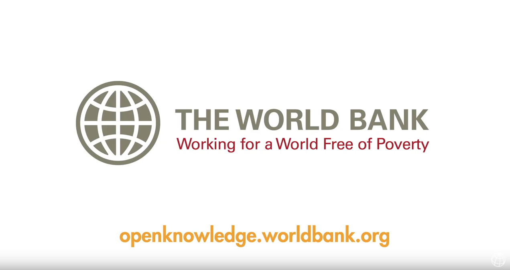

# MPP-capstone


<a href="https://youtu.be/XoYwATEDAAM
" target="_blank"></a>


The World Bank has two ambitious goals: ending extreme poverty and boosting shared prosperity. Each year the World Bank releases hundreds of research publications in the form of books, reports, journal articles, and working papers. This collection of knowledge spans a wide variety of development topics — from macroeconomics and economic growth to water resources, conflict and development, education, gender equality, and much more.

While such research holds a wealth of useful knowledge for global development, the large volume can make it difficult to find relevant publications. Keywords can help, but these often differ across publications and change over time, and some research from decades prior may lack them altogether.

Increasing the ability of policymakers to access relevant work can enable more informed policy choices and allow governments to learn from what has succeeded or failed in other countries. Better policies are key to addressing some of the world's most pressing development challenges and improving the lives of people around the globe.

In this challenge, you will use standard natural language processing (NLP) tools to identify 24 different topics in World Bank publications.

- https://www.datasciencecapstone.org/competitions/17/world-bank-topics-publications/page/53/

### About the Data
Your goal is to predict the topic(s) of publications from the World Bank, where there are 24 possible topics. You will be given the first six pages of text from each document. Each document has at least one topic and can have multiple topics. This is known as a multilabel problem.

### Performance Metric
To measure your model's performance, we'll use the F1 score which balances the precision and recall of a classifier. Traditionally, the F1 score is used to evaluate performance on a binary classifier, but since we have 24 possible labels we will use a variant called the micro averaged F1 score.

and TP is True Positive, FP is False Positive, FN is False Negative, and k represents each class in 1,2,3...24.

In Python, you can easily calculate this loss using sklearn.metrics.f1_score with the keyword argument average='micro'. Here are some references that discuss the micro-averaged F1 score further:

<hr>


## My Approach

- Clean text (Tokenize, lower, remove stopwords, lemmentize, stem etc)
- CountVectorizer on 10000 words for features
- Use Average word length as feature
- length of document
- Scale Features
- Sentiment and subjectivity of document text
- Do not downsample training data
- Train models for each topic:
    - Linear SVC and Logistic Regression
- Iterate over each model with the corresponding topic for ```submission_format.csv```
- Do inference and save results to dataframe
- Save results as CSV

## Results
If your model scores a micro F1 score lower than 0.61, your grade will be 1/100.
Models that score a micro F1 score of 0.61 will earn you a grade of 70/100.
Models that score a micro F1 score of 0.67 will earn you a grade of 90/100.

- **My Results: 62.8**
- **https://github.com/AaronWard/MPP-capstone/blob/master/submission6/preprocess-six.ipynb**